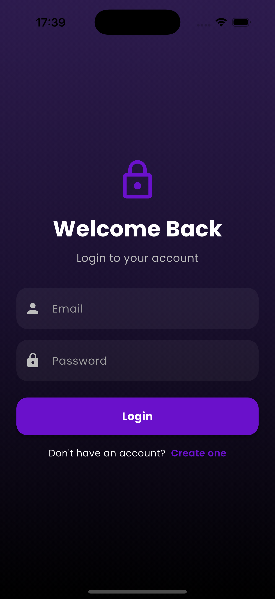
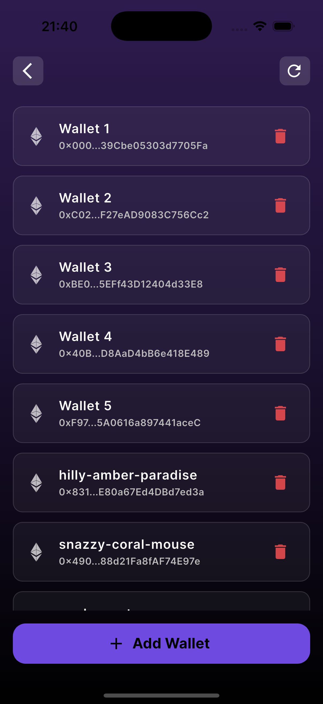
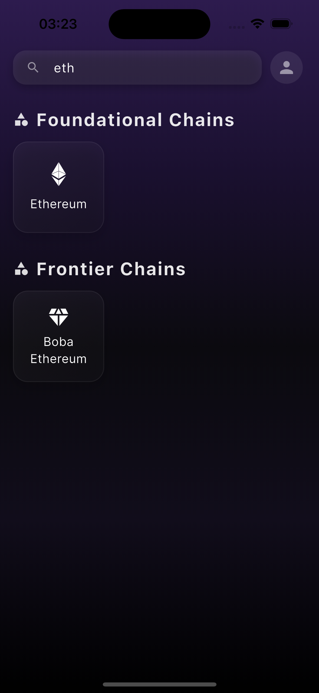
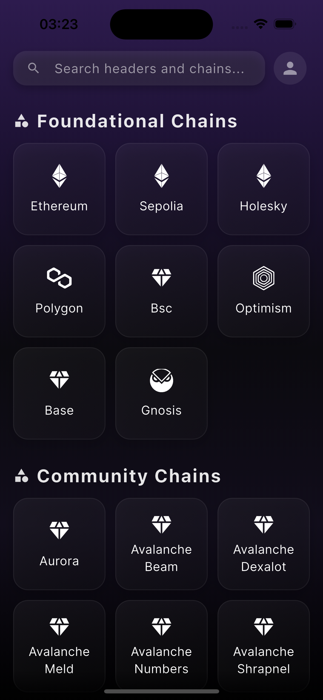

# CryptoCredit Frontend

This repository contains the source code for the official **Flutter** mobile application for **CryptoCredit**, a protocol for generating a transparent and trustable crypto credit score.

The application provides a user friendly interface to interact with the **CryptoCredit Backend API**, allowing users to track their wallets and understand their on chain financial reputation.

The app is designed with a **clean**, **intuitive**, and **dark mode first** interface to make complex blockchain data easily accessible.

---

## ✨ Features

* 🔐 **Secure Authentication** — Simple and secure sign-up and login flow to protect user accounts.
* 🌐 **Multi-Chain Support** — Supports a wide array of foundational and community-driven blockchain networks.
* 🔗 **Multi Wallet Management** — Easily add, verify, and manage multiple wallet addresses.
* 📊 **Credit Score Dashboard** — A visually intuitive speedometer gauge displays your crypto credit score (0–900).
* 📈 **Detailed Analytics** — Dive deep into the metrics that make up your score, including transaction quality, portfolio diversification, wallet age, gas usage, and more.
* 📜 **Transaction History** — View a list of recent transactions from your linked wallets.
* 📱 **Sleek & Responsive UI** — A modern, clean design built with Flutter for iOS and Android.
* 👨‍💻 **Developer API** — Integrated API access for developers with key management and usage tracking.

---

## 📸 Screenshots

### Authentication & Onboarding

| Create Account                             | Login                             | No Wallet Found                             |
| ------------------------------------------ | --------------------------------- | ------------------------------------------- |
|  |  |  |

---

### Wallet Management

| Add Wallet                             | Wallets                             |
| -------------------------------------- | ----------------------------------- |
|  |  |

| Search Chain                             | Select Chain                             |
| ---------------------------------------- | ---------------------------------------- |
|  |  |

---

### Credit Score Dashboard

| 100/900                                    | 325/900                                    |
| ------------------------------------------ | ------------------------------------------ |
|  |  |

| 550/900                                    | 775/900                                    |
| ------------------------------------------ | ------------------------------------------ |
|  |  |

---

### Analytics

| Analytics 1                             | Analytics 2                             |
| --------------------------------------- | --------------------------------------- |
|  |  |

---

### Developer API

| API Home                             | API Expanded                             |
| ------------------------------------ | ---------------------------------------- |
|  |  |

| Create API Key                         | Copy API Key                             |
| -------------------------------------- | ---------------------------------------- |
|  |  |

---

## 🛠 Technology Stack

This application is built with **Flutter** for a high performance, cross platform mobile experience.

* **Framework**: Flutter
* **State Management**: Provider
* **API Client**: Dio
* **UI Components**: Flutter Material Components

---

## ⚙️ Installation & Setup

This application is designed to be plug and play once the backend is configured.

### Prerequisites

* Flutter SDK installed.
* A running instance of the [**CryptoCredit Backend API**](https://github.com/pratyakshkwatra/cryptocredit_backend).

### Steps

#### 1. Set Up the Backend *(Crucial First Step)*

This frontend requires the [**CryptoCredit Backend API**](https://github.com/pratyakshkwatra/cryptocredit_backend) to be running.
Follow the setup instructions in the backend repository and ensure it’s available at:

```
http://localhost:8000
```

#### 2. Run the Frontend Application

Once the backend is running:

```bash
# Clone the repository
git clone https://github.com/pratyakshkwatra/cryptocredit_frontend
cd cryptocredit_frontend

# Install dependencies
flutter pub get

# Run the application
flutter run
```

🟢 The app should now be running on your connected device or simulator.

---

## Problem Statement

> **Design and develop a protocol that aggregates on-chain user behavior such as transaction history, staking habits, and DeFi interactions into a transparent, trustable crypto credit score.**
>
> The system should encourage accountability and enable fairer financial decisions in the decentralized ecosystem.

---

Made with 💜 by  [**Pratyaksh Kwatra**](https://github.com/pratyakshkwatra) & [**Aarav Rai**](https://github.com/Aarav-Rai)
Fueled by ☕, powered by 🚀, and sprinkled with a bit of ✨ magic.